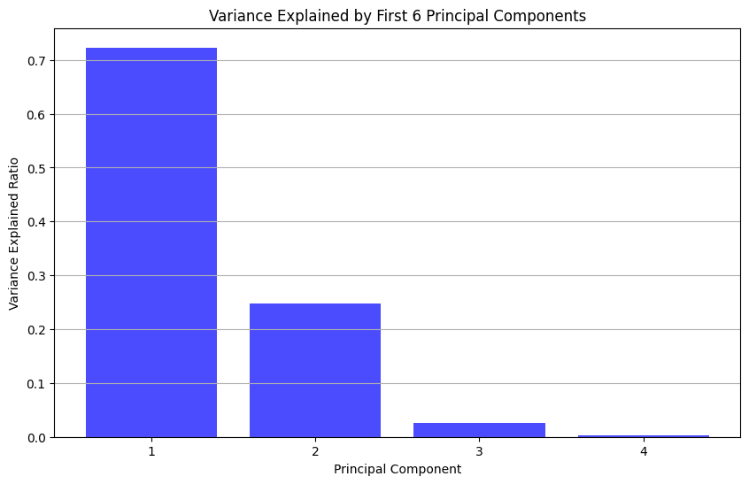
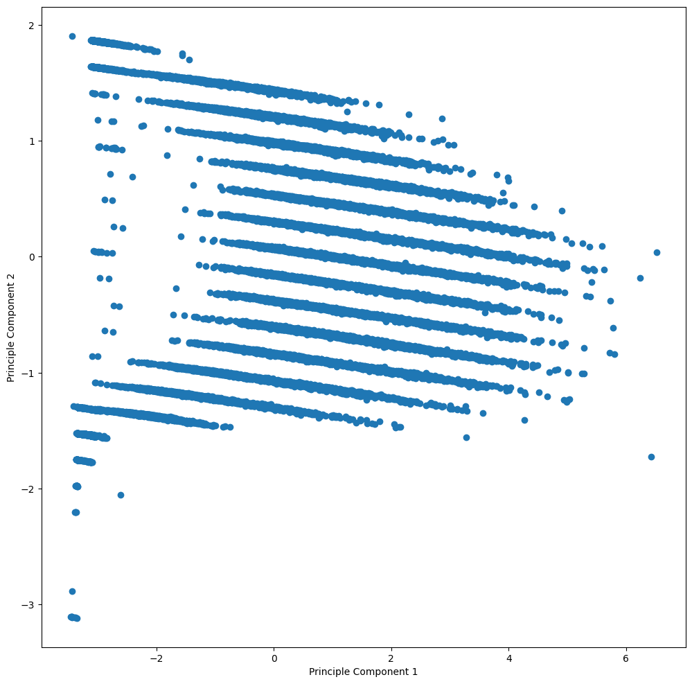
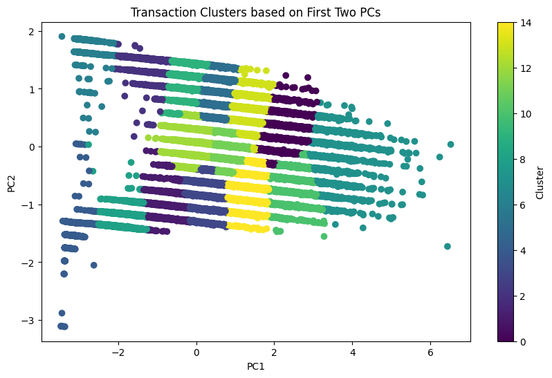

# Grocery Store Transactions: Principle Component Analysis

This project analyzes grocery store transaction data using Principal Component Analysis (PCA) to identify patterns and relationships between hourly metrics:
- Hourly spending
- Transaction count
- Total items purchased

Component 1 explains 72% of variance, primarily driven by the dataset having only four dimensions. The first two PCs explain over 95% of the variance. 

 The three variables with the highest loadings for Principal Component 1 (PC1) were Items, Spend, and Transactions, all of which exhibited a positive correlation. In contrast, Hours showed minimal correlation with PC1.

To further investigate, I created a scatter plot with PC1 on the x-axis and PC2 on the y-axis. I then applied k-means clustering to identify 15 groups, focusing on target customers where both PC1 and PC2 are greater than 1. 

In conclusion, by applying the PCA dimensionality reduction technique, I clustered grocery store transaction data. However, due to the limited value of insights gained from the clustering, I do not recommend proceeding with further analysis. If further investigation were to be conducted, I would consider analyzing each cluster using linear regression while experimenting with an decreased number of clusters.

## Tools Used
- Python
- scikit-learn (PCA implementation)
- Pandas for data manipulation
- Matplotlib/Seaborn for visualization
